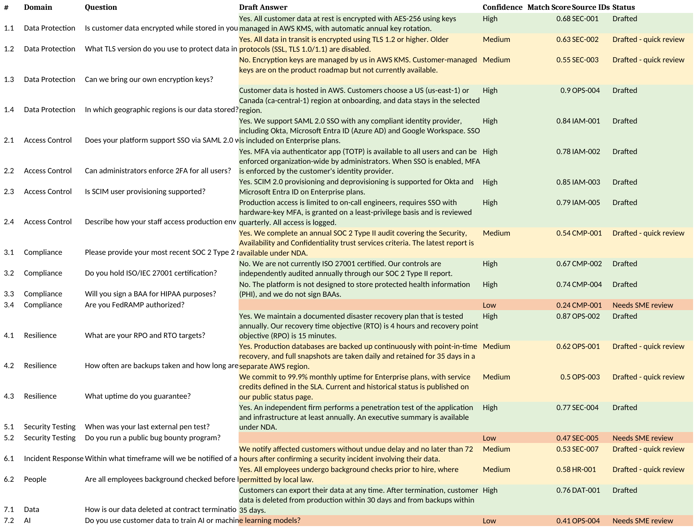

# rfp-autopilot

Takes a security questionnaire / RFP spreadsheet and drafts answers from a library of answers that have already been approved. If it can't find a good match it leaves the answer blank and flags it for a human instead of guessing.


*(the sample questionnaire after a run - green = drafted, yellow = drafted but worth a look, red = needs a human)*

## why

If you sell software to bigger companies you get these questionnaires constantly - 100 to 300 rows of "do you encrypt data at rest", "do you support SAML SSO", "what's your RTO/RPO". Almost all of it has been answered before, it's just scattered across old questionnaires, the SOC 2 report, policy docs, etc. so someone ends up copy-pasting for hours.

The part I cared most about was **not making stuff up**. A wrong "yes" on a security questionnaire can end up in a contract. So there are two places where it bails out to a human:

1. before the LLM is even called - if the closest approved answer isn't similar enough (score below `--min-match`), the row is marked "Needs SME review" and nothing gets drafted
2. inside the prompt - the model is told to only use the approved answers it's given and to reply `INSUFFICIENT_CONTEXT` if they don't actually answer the question. that also routes to a human

Every drafted answer also gets the source IDs it came from, so whoever reviews it can check the original wording quickly.

## how it works

```
questionnaire.xlsx
  -> for each question, find the 3 closest approved answers (TF-IDF)
  -> best score too low?  -> "Needs SME review", no answer
  -> otherwise Claude drafts an answer using only those 3
  -> answer / confidence / score / source IDs / status written back into the sheet
```

- **retrieval** is TF-IDF on word n-grams + character n-grams, plus a small list of security acronyms that get expanded (SSO -> single sign-on, 2FA -> MFA, RTO, PHI...). I went with TF-IDF over embeddings because it's easy to debug, needs no API key, and is fine for a library of a few thousand answers. Swapping it later only touches `retriever.py`.
- **aliases**: each library entry can have alternate phrasings (pipe-separated) since buyers word the same question 10 different ways. When someone answers a flagged question you add it to the library (or add the new wording as an alias) and next time it drafts automatically.
- **no API key?** it runs in "offline" mode and just reuses the best-matching approved answer word for word. tests + CI use this mode.

## running it

```bash
pip install -r requirements.txt

# offline, no API key
python -m rfp_autopilot examples/sample_questionnaire.xlsx --offline

# with Claude
export ANTHROPIC_API_KEY=...
python -m rfp_autopilot path/to/questionnaire.xlsx --library data/answer_library.csv
```

Output on the sample (21 questions):

```
Library: 25 approved answers | Drafter: ExtractiveDrafter
21 questions: 11 drafted, 7 need a quick review, 3 flagged for SME review

Flagged for SME review:
  row 13: Are you FedRAMP authorized?
  row 18: Do you run a public bug bounty program?
  row 22: Do you use customer data to train AI or machine learning models?
```

Those 3 are the ones the library actually has nothing for, which is what I wanted to see.

Other flags: `--sheet`, `--header-row`, `--min-match`, `--high`, `-o`. The questionnaire just needs a column with "question" somewhere in the header. Model defaults to `claude-sonnet-4-5`, override with `ANTHROPIC_MODEL`.

There's also a GitHub Action - drop an .xlsx into `inbox/`, push, and it attaches the answered file to the workflow run. Add `ANTHROPIC_API_KEY` as a repo secret if you want LLM drafting there.

## known issues / stuff I'd fix next

- thresholds (0.48 to draft, 0.65 for "High") were tuned on the sample questionnaire only. a couple of rows sit right on the edge (uptime is 0.50, bug bounty is 0.47) so they'll need re-tuning on a real library
- in offline mode the answers can read a bit off - e.g. "What TLS version do you use?" gets back "Yes. All data in transit is encrypted using TLS 1.2 or higher..." because it's just reusing the approved text. LLM mode rewrites it properly
- TF-IDF still misses some paraphrases with no shared words. that's what the aliases are for for now, but embeddings would help
- xlsx only, one sheet at a time
- would like a small review UI where you approve/edit the drafts and they get saved back into the library

## layout

```
rfp_autopilot/   library.py, retriever.py, drafter.py, pipeline.py, cli.py
data/            answer_library.csv (made-up company)
examples/        sample questionnaire + the answered output
tests/           pytest, LLM is mocked
```

`python -m pytest -q` to run the tests.

The answer library is for a fictional SaaS company, it's just there for the demo.
