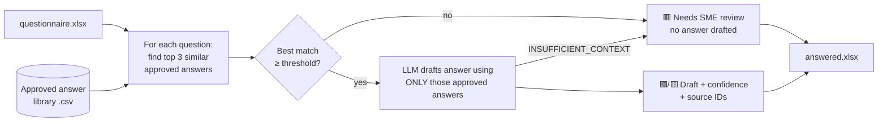

# RFP Autopilot

**Draft answers to security questionnaires and RFPs from your library of approved answers — and flag what a human needs to answer instead of making it up.**


## The problem

Companies that sell to enterprises get long security questionnaires and RFPs — often 100–300 questions in a spreadsheet:

> *"Do you encrypt data at rest?" · "Do you support SAML SSO?" · "What are your RTO and RPO?"*

Most of these have been answered before, but the answers live in old questionnaires, whitepapers and policy docs. Solutions Engineers and security teams end up rewriting them by hand, every deal.

## What this does

Upload the spreadsheet → get back the same spreadsheet with a drafted answer, a confidence level and the source IDs for every question. Reviewers only look at what's flagged.

| # | Question | Draft Answer | Confidence | Source | Status |
|---|---|---|---|---|---|
| 2.1 | Does your platform support SSO via SAML 2.0 with Okta? | Yes. We support SAML 2.0 SSO with any compliant identity provider, including Okta… | High (0.84) | IAM-001 | 🟩 Drafted |
| 3.1 | Please provide your most recent SOC 2 Type 2 report. | Yes. We complete an annual SOC 2 Type II audit… available under NDA. | Medium (0.54) | CMP-001 | 🟨 Drafted – quick review |
| 3.4 | Are you FedRAMP authorized? | — | Low (0.24) | — | 🟥 Needs SME review |
| 7.2 | Do you use customer data to train AI models? | — | Low (0.41) | — | 🟥 Needs SME review |

On the included 21-question sample: **11 drafted, 7 quick reviews, 3 flagged** — and the 3 flagged are exactly the ones the library has no approved answer for.

## How it works

Retrieval + grounded generation, with a guardrail in the middle:



1. **Library** — `data/answer_library.csv`: each approved answer has an ID, the canonical question, optional alternate phrasings (`aliases`, pipe-separated), the answer and where it was approved (SOC 2 report, DPA, admin guide…).
2. **Retrieve** — TF-IDF over word n-grams *and* character n-grams, plus a small security-acronym expander (`SSO ↔ single sign-on`, `2FA ↔ MFA`, `RTO`, `PHI`…). Each library entry is scored by its best-matching phrasing. No vector DB or API key needed.
3. **Guardrail** — if the best match is below `--min-match` (default 0.48), the question is **flagged for an SME and no answer is generated**.
4. **Draft** — otherwise Claude writes the answer with a strict system prompt: use only facts in the approved answers, or reply `INSUFFICIENT_CONTEXT` (which also routes to an SME). Temperature 0.
5. **Write back** — answer, confidence (High / Medium / Low), match score, source IDs and status are added as color-coded columns in the original sheet. Re-running reuses those columns.

### Design decisions

- **Refusing beats guessing.** A wrong "Yes" on a security questionnaire can become a contractual commitment. The tool has two independent ways to say "a human should answer this": a retrieval-score threshold *before* the LLM is called, and the LLM's own `INSUFFICIENT_CONTEXT` escape hatch *after*.
- **Every answer is traceable.** Source IDs go in the spreadsheet so a reviewer can check the approved wording in seconds.
- **Works offline.** Without `ANTHROPIC_API_KEY` it runs in extractive mode (reuses the best approved answer verbatim). Tests and CI use this mode, and the LLM is mocked in unit tests.
- **The library gets smarter over time.** When an SME answers a flagged question, add it (or add the new phrasing as an alias) and the next questionnaire auto-drafts it.
- **Simple retrieval on purpose.** TF-IDF is transparent, fast and good enough for a few thousand answers; `Retriever` is one small class, so swapping in embeddings later is a contained change.

## Quick start

```bash
git clone https://github.com/richsudaniman/rfp-autopilot.git
cd rfp-autopilot
pip install -r requirements.txt

# Offline mode (no API key needed)
python -m rfp_autopilot examples/sample_questionnaire.xlsx --offline

# LLM mode
export ANTHROPIC_API_KEY=sk-ant-...
python -m rfp_autopilot path/to/questionnaire.xlsx --library data/answer_library.csv
```

```
Library: 25 approved answers | Drafter: ExtractiveDrafter
21 questions: 11 drafted, 7 need a quick review, 3 flagged for SME review

Flagged for SME review:
  row 13: Are you FedRAMP authorized?
  row 18: Do you run a public bug bounty program?
  row 22: Do you use customer data to train AI or machine learning models?

Saved -> examples/sample_questionnaire_answered.xlsx
```

Options: `--sheet`, `--header-row`, `--min-match`, `--high`, `-o/--output`, `--offline`, `--llm`. Model is set with `ANTHROPIC_MODEL` (default `claude-sonnet-4-5`).

### As a GitHub automation

Push a questionnaire into [`inbox/`](inbox/) and the **Answer questionnaires** workflow drafts it and attaches `<name>_answered.xlsx` to the run. Add an `ANTHROPIC_API_KEY` repository secret to enable LLM drafting.

## Project layout

```
rfp_autopilot/
  library.py    load + validate the approved-answer CSV
  retriever.py  TF-IDF (word + char n-grams) similarity search
  drafter.py    LLMDrafter (Claude, grounded) / ExtractiveDrafter (offline)
  pipeline.py   thresholds, guardrail, spreadsheet read/write
  cli.py        command-line interface
data/answer_library.csv          sample library (fictional company)
examples/sample_questionnaire.xlsx  + _answered.xlsx output
tests/                           pytest suite (LLM mocked)
.github/workflows/                tests + inbox automation
```

## Tests

```bash
pip install pytest
python -m pytest -q
```

## Next steps

- Embedding-based retrieval for larger libraries
- Small web UI for upload → review → approve, writing approved answers back to the library
- Answer freshness: flag library entries whose source document is older than N months

---

*The answer library describes a fictional SaaS company and is for demonstration only.*
